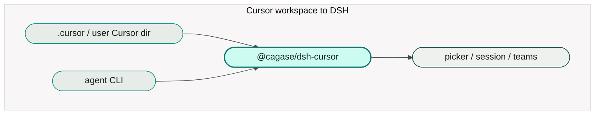

# @cagase/dsh-cursor

DeepSeek Harness plugin so a Cursor workspace runs in DSH without copying skills, rules, or hooks into `.dsh/`, and without patching the model picker.



## Install

Requires DeepSeek Harness 0.1.5-rc.1 or newer. Add the bundle to each profile, then restart that profile:

```sh
dsh plugin --profile web add @cagase/dsh-cursor
dsh plugin --profile headless add @cagase/dsh-cursor
```

Use the profile you actually run (`web`, `headless`, or another named profile). Confirm the HOST-plane row:

```sh
dsh --profile web --dump-config
# id: dsh-cursor  name: @cagase/dsh-cursor
```

From a git checkout before the package is on npm: `dsh plugin --profile web add .`

## Cursor CLI login

Model routes need the Cursor `agent` CLI on `PATH` and a login:

```sh
agent login
agent status --format json
agent models
```

`CURSOR_API_KEY` or `CURSOR_AUTH_TOKEN` also counts as a credential. `CURSOR_AGENT_BIN` overrides the binary path.

Missing binary fails with `MISSING_CREDENTIAL`. Not logged in fails with `AUTH` (`Run agent login`). The plugin does not fall back to another provider.

## Paths the plugin reads

User root is `$CURSOR_CONFIG_DIR` when set, otherwise `~/.cursor`.

Project root is `<workspace>/.cursor`.

| Path | Mapped |
|------|--------|
| `{user,project}/skills/**/SKILL.md` | Skill catalog (`/name`, `skill` tool) |
| `{user,project}/agents/*.md` | Delegation-spec catalog skills |
| `{user}/skills-cursor/**/SKILL.md` | Off unless `skillsCursor: true` |
| `{project}/rules/**/*.mdc` | alwaysApply / glob / description / manual |
| `<repo>/.cursorrules` | Always-apply blob |
| Nested `AGENTS.md` between repo root (exclusive) and cwd | Always-apply memory |
| `{user,project}/hooks.json` | Command hooks |
| `{user}/cli-config.json`, `{project}/cli.json` | Deny tokens at `tools/pre-execute` |
| `{user,project}/mcp.json` | `mcp__cursor__<server>__*` |

Live reload watches those files when `watch: true` (default).

## Hook commands

`hooks.json` entries are a **shell string**. DSH runs them with `shell: true` and JSON on stdin.

Supported command forms:

- a shell one-liner (`sh`, `printf`, pipelines)
- `bun` / `tsx` scripts
- `python` scripts
- a shebang executable

Prompt-type hooks are not implemented. See [docs/behavior-matrix.md](docs/behavior-matrix.md).

## AgentTeams

Set member `provider: cursor` and a slug from `agent models`. Keep mailbox and task tools. Do not add `cursor_agent_*` ACP tools.

```yaml
members:
  - name: implementer
    provider: cursor
    model: cursor-grok-4.6-high
    reasoningEffort: high
    tools:
      - mailbox
      - task
```

After login, catalog slugs already include Fast (`*-fast`) and Extra High (`*-xhigh`). `reasoningEffort: xhigh` maps to CLI `[effort=max]`.

`agent --print` is a full Cursor agent turn. DSH tool schemas are not forwarded.

## Unsupported (honest)

The plugin does **not** provide:

- Prompt-type hooks
- `updated_input` argument rewrite
- `subagentStart` deny
- Cursor Settings UI user rules (non-file)
- Marketplace plugins, themes, `.cursorignore`
- MCP OAuth
- Enterprise / team hook tiers
- Cursor `approvalMode` / `sandbox.json` (DSH owns approval and sandbox)
- Tab / `workspaceOpen` / `preCompact` / `afterAgentThought` hooks

Status of each mapping: [docs/behavior-matrix.md](docs/behavior-matrix.md). Harness seams that still block us: [docs/core-gaps.md](docs/core-gaps.md).

## Config

```yaml
- id: dsh-cursor
  config:
    assets: true
    models: true
    skillsCursor: false
    watch: true
```

## Scripts (from source)

`npm run build` · `npm run verify` · `npm run verify:fixture` · `npm run verify:models:live`

## License

MIT
